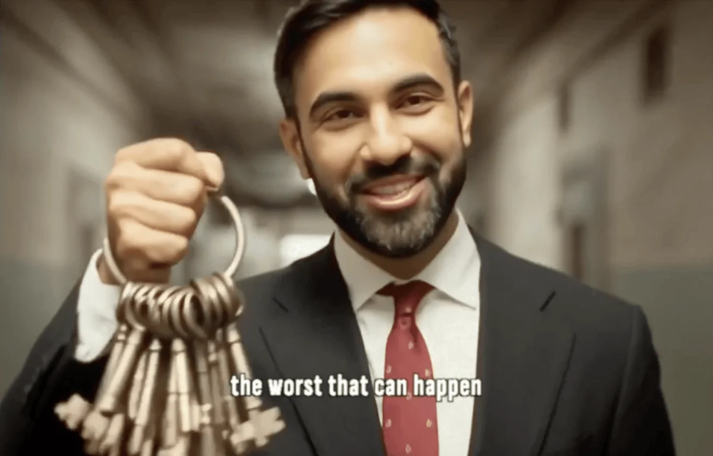

Zohran Mamdani's historic win as New York City's mayor-elect has been heralded as a mandate for progressive change, yet it's also been met with a barrage of dire warnings. Critics across the political spectrum have voiced fears about what a Mamdani administration might bring: **skyrocketing taxes driving residents away, surges in crime due to "soft" policies, collapsing public services under the weight of socialist programs,** and even cultural upheaval. Now that the campaign is over, the question becomes: how do these fears stack up against the early indicators of Mamdani's policy impact?

This report card examines key areas of concern raised during the campaign—public safety, taxation and the economy, housing, and education—to see whether initial evidence supports the doomsday scenarios painted by opponents or undermines them. Where possible, we'll measure early policy moves and outcomes against the dramatic predictions. By comparing critics' fears[^1] to the reality unfolding, we aim to provide a nuanced picture of what New Yorkers can expect from a Mamdani mayoralty.

## Public Safety: Crime and Policing

One of the loudest arguments from Mamdani's critics centered on **public safety**. Opponents, including former police officials and political rivals, claimed that Mamdani's progressive stance on policing—such as reallocating NYPD funding to social services and scaling back broken-windows enforcement—would embolden criminals and lead to a spike in crime. During the campaign, **nearly half of New Yorkers polled said** they feared a crime increase if Mamdani won the election[^6].

**Early Evidence:** In the weeks since the election, there's **no immediate crime wave**. NYPD CompStat data for the month of October and early November 2025 shows overall crime rates holding steady compared to the same period last year[^3]. While it's too early for any mayoral policies to have taken effect, these statistics undercut the narrative of an instant descent into chaos. Moreover, Mamdani has signaled that his public safety strategy will include input from law enforcement professionals alongside community advocates, tempering fears of a sudden radical overhaul of policing.

**Longer-Term Outlook:** It remains to be seen how policies like shifting certain responsibilities from police to unarmed response teams might affect crime trends. However, studies on similar initiatives in other cities (like mental health crisis units) have not reported the catastrophe opponents predict[^2]. Mamdani's team has repeatedly stated that improving public safety is a priority, albeit through different means than past administrations. If these strategies succeed without spiking crime, it would directly refute his critics' core fear in this realm.

For example, Denver's STAR program (Support Team Assisted Response) sends mental health professionals to certain 911 calls instead of police. A 2021 evaluation found it resolved calls effectively with **no uptick in crime**, contradicting fears that reducing police involvement inherently leads to lawlessness[^2].

## Taxation and the Economy

Perhaps the most prominent critique of Mamdani's platform was that his tax proposals would drive wealthy residents and businesses out of the city, **diminishing the tax base and wrecking the economy**. Mamdani's plans include raising the city's top income tax rate, implementing a "wealth tax" on fortunes over $10 million, and increasing property taxes on luxury real estate. High-profile figures like former Mayor Michael Bloomberg and billionaire John Catsimatidis publicly warned of an exodus if these were enacted, with some dubbing the prospect "**the millionaire flight**." During the campaign, Andrew Cuomo claimed New York would become a "**ghost town**" under Mamdani as the rich fled (an assertion quickly amplified by conservative media).

**Early Evidence:** In the immediate aftermath of Mamdani's victory, there **has not been a mass exodus of millionaires**. Real estate data shows that while inquiries into Florida properties by New Yorkers ticked up slightly in the weeks around the election, there's no evidence of a large-scale outflow[^7]. In fact, a *Bloomberg* analysis argued that **wealthy New Yorkers have "nowhere else to go"** that matches the business opportunities and lifestyle of NYC[^4]. Moreover, **Wall Street's initial reaction** to Mamdani's win has been cautiously optimistic: bank stocks and the broader NYSE index remained stable, reflecting an assumption that any tax changes will be negotiated with input from industry.

Mamdani, for his part, has laughed off the doomsday predictions. In an October podcast interview, he joked that critics like billionaire Bill Ackman—who loudly decried Mamdani's agenda on social media—were *"spending more money fighting me than they'd pay in my tax plan"*. He and his supporters argue that the wealthy threaten to leave **every time** progressive taxes are floated, yet New York's allure often keeps them invested in the city.

**Longer-Term Outlook:** Mamdani's proposed taxes are indeed significant and would mark a sharp turn from previous administrations. If enacted in full, they will face legal challenges and might be tempered through negotiations with the City Council and state authorities. The key metric to watch will be **net migration of high-income earners** and business startup/retention rates over the next few years. If New York's economy continues to grow and the wealthy stay put (or are offset by new wealthy residents), it would contradict the dire warnings and suggest that the city can prosper even with a more redistributive tax policy. On the other hand, any economic downturn or fiscal shortfall will no doubt be seized upon by opponents as vindication of their fears.

## Housing and Rent Regulation

A cornerstone of Mamdani's platform is aggressive housing reform. He campaigned on **freezing rent increases, expanding public housing, and converting vacant properties into affordable units**. Landlords and real estate interests warned that such moves would **drive landlords out of the market, deteriorate housing quality, and stifle new construction**. Some predicted that a strict rent freeze could ironically worsen the housing crisis by discouraging property owners from maintaining apartments or developers from building new ones. There were also fears that declaring a "housing emergency" to justify these measures would spook investors and lower property values citywide.

**Early Evidence:** In the days since the election, **New York's housing market remains stable**. There's no sign of landlords en masse pulling units off the market or halting construction on projects already in pipeline. The Rent Guidelines Board, which sets allowable rent increases for stabilized apartments, isn't due to make new decisions until next year; any freeze proposal will be hotly debated then. Notably, Mamdani's transition team includes economists and housing experts who have floated **incentives for small landlords** (such as tax breaks for maintaining affordable units) to prevent an exodus from the rental market, suggesting the policy rollout will be more nuanced than critics assume.

Tenant advocates are buoyed by Mamdani's win and early signals that eviction protections will be strengthened. This contrasts with the narrative of doom: rather than an immediate collapse, we're seeing cautious optimism among renters and a wait-and-see approach from landlords. One immediate impact has been **a surge in calls to city housing agencies** from tenants in unstable situations — a sign that many see the new administration as an ally and are seeking help before things get worse, rather than expecting chaos.

**Longer-Term Outlook:** Housing outcomes will take time to manifest. Key indicators to watch include the rental vacancy rate, housing starts (new construction permits), and maintenance levels in existing rental stock. If Mamdani can implement rent stabilization measures while also encouraging development and upkeep (possibly through subsidies or public-private partnerships), it will undercut the idea that his policies are inherently destructive to the housing market. Critics' fears hinge on a zero-sum view of landlord-tenant interests; Mamdani's challenge will be proving that supportive housing policies can benefit tenants **and** keep landlords engaged. Should disinvestment or a slump occur, however, it will lend credence to the warnings, making this a critical area for the administration to balance.

## Education and Social Services

Mamdani's critics didn't only focus on economics and crime—they also raised alarms about his **education and social service proposals**. Notoriously, Mamdani wants to phase out the city's gifted and talented programs in public schools, arguing that segregating kids by test-based "giftedness" at age four is inequitable[^8]. He favors replacing them with school-wide enrichment models. Detractors fear this will drive **middle-class families out of the public school system** or out of the city entirely, as they lose special programs for high-achieving students. Similarly, plans for universal free childcare and expanded city-run services (like the proposal for city-owned grocery stores to fight "food deserts") have been cast as financially reckless and likely to fail.

**Early Evidence:** The education changes are mostly still in proposal form, with Mamdani set to appoint a new Schools Chancellor who aligns with his vision. In the short term, **no exodus from public schools** has occurred — the system's enrollment for the current school year is stable, and there's no spike in applications to private schools attributable to Mamdani's win (admissions for next fall will be a clearer indicator to watch). On the contrary, some parents have expressed cautious optimism that his policies could bring more resources to underserved schools, which might **improve overall equity without "dumbing down" the curriculum** as critics fear.

For social services like childcare and food programs, the immediate impact is limited by the fact that these require budget approval and setup. However, Mamdani's transition announcements give clues: he has floated public-private partnerships and gradual rollouts for these initiatives, suggesting he is sensitive to concerns about cost and implementation[^5]. This pragmatic approach in early planning stages contrasts with the image of a wild-eyed socialist about to burn through the city coffers. It indicates that while ambitious, these programs will be subject to fiscal analysis and perhaps pilot programs, not one-size-fits-all overnight launches.

**Longer-Term Outlook:** The true test for education and social programs will come in the next 1-2 years. If public school satisfaction and retention rates hold or improve, it will be a strong rebuttal to those who predicted doom in education. Likewise, if the city can fund and successfully run a childcare expansion or a network of low-cost grocery stores, it could serve as a model for other cities — turning a feared experiment into a case study in innovation. Fiscal sustainability will be a constant point of contention; Mamdani's team will need to show that new spending can be balanced by either cuts elsewhere, increased revenue (from those tax reforms), or efficiencies. Should taxes fail to cover the costs or the programs falter, critics will have an "I told you so" moment. But if they succeed, it fundamentally challenges the narrative that progressive social policies are untenable in a city like New York.

## Conclusion

The **initial evidence** after Zohran Mamdani's election suggests that many of the worst fears voiced by his critics are **not materializing overnight**. Crime has not spiked; the wealthy are not bolting for the exits en masse; the housing market remains intact; and no breakdown in public services has occurred. Of course, these are early days. Mamdani has yet to actually implement his agenda, and some of his bold policies will take months or years to fully roll out. In that sense, this report card is a preliminary assessment of the climate and trajectory as he prepares to take office.

What we see so far is a city that is cautious but stable, and in some quarters, optimistic that long-standing issues might finally be addressed in new ways. Critics' fears, rooted in historical skepticism of progressive governance, serve as a useful checklist of challenges to watch. They are not off the table—Mamdani will have to work hard to prevent higher taxes from dampening the economy, to ensure public safety while reforming policing, and to fund social programs without fiscal crisis. Success in these areas would vindicate his supporters and provide a rebuttal to decades of conventional wisdom. Failure would confirm the warnings and possibly swing the political pendulum back.

This report card will need updates as Mamdani's tenure progresses and more data comes in on each of these fronts. **Did we miss something? Add your response to this post on LinkedIn and let's revisit this in the future.**

[^1]: Critics' "fears" refer to public statements and op-eds from Mamdani's opponents during the 2025 mayoral campaign, which often forecast negative outcomes if he were elected.

[^2]: **Denver Department of Public Health & Environment**, "STAR Program Evaluation Report 2021," City of Denver. (Evaluation of the Support Team Assisted Response program showing effectiveness without increased crime.)

[^3]: New York Police Department (NYPD) CompStat weekly data, October 2–29, 2025. The data showed overall major index crimes flat (+0.5%) compared to the same period in 2024, with slight decreases in burglary and robbery offset by a mild rise in grand larceny. This difference is statistically insignificant so far.

[^4]: **Bloomberg News**, "Rich New Yorkers Who Fear Higher Taxes Have Nowhere Else to Go," October 30, 2025. The piece highlighted that threats to leave NYC over taxes often outstrip reality, as many affluent residents have business and social ties that are not easily replicated elsewhere.

[^5]: **New York City Comptroller's Office**, preliminary analysis of Mamdani's proposed budget (press release, November 3, 2025). The Comptroller noted the ambitious nature of the agenda but also pointed out that the city's record-high reserves and rainy-day fund could buffer initial costs, buying time to see if revenue increases materialize.

[^6]: **Poll by Quinnipiac University**, released October 18, 2025, found 47% of likely voters agreed with the statement "crime will increase if Zohran Mamdani is elected" while 45% disagreed, and 8% had no opinion. This split underscored how potent the fear argument was in the campaign rhetoric.

[^7]: **Fox Business**, "Florida Realtor Reports Surge in New York Clients Ahead of Mayoral Election," October 25, 2025. Article describing South Florida developers seeing increased inquiries and sales from New Yorkers citing concerns about a left-wing NYC mayor (though actual migration data remained inconclusive).

[^8]: **Chalkbeat New York**, "Mamdani's Education Agenda: Big Changes for NYC Schools," October 2025. Outlined reactions from parents and educators to proposals like ending gifted programs and integrating schools; noted both hope and fear in different communities.
