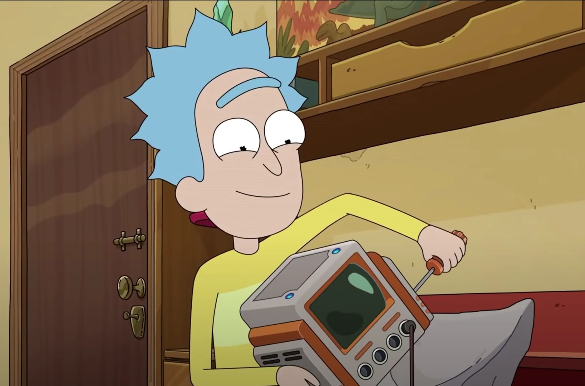

## The Difference Between 'I Don't Know' and 'It Can't Be Known'

Few things frustrate me more than the nihilistic strain I sometimes encounter in technology circles. You know the type: the engineer who throws up their hands and declares, *“It won’t work. There’s no way to know. We can’t possibly tell.”*

That’s not rigor. That’s surrender.

I’d much rather work with someone who tells me plainly, *“I don’t know.”* Honesty, humility, and a willingness to admit uncertainty—that’s where the real work begins. From there, we can test, we can measure, we can learn. But when someone shrugs and dismisses the effort altogether, they’re not practicing engineering. They’re hiding behind a convenient wall of fatalism.

Technology, by definition, is about building. It’s about trying, failing, adjusting, and trying again. It’s about moving forward when the path is unclear. If your instinct is to declare that something is unknowable or unworkable before even attempting to engage—then you’re not a technologist. You’re a spectator.

What infuriates me is that nihilism masquerades as sophistication. Some will posture as though it’s *deep wisdom* to say “the world is too complex” or “there’s no way to solve this.” But in reality, it’s intellectual laziness dressed up in pseudo-philosophy.

I’m not looking for clairvoyance. I don’t expect every engineer to have the answer. What I expect is honesty, clarity, and the courage to admit when you don’t know—paired with the willingness to roll up your sleeves and figure it out. That’s the only way progress is made.

So if you work with me, don’t tell me *it can’t be done.* Don’t tell me *it won’t work.* Tell me instead, *“I don’t know yet, but I'm going to find out.”*

Because that’s what it means to be in tech.

