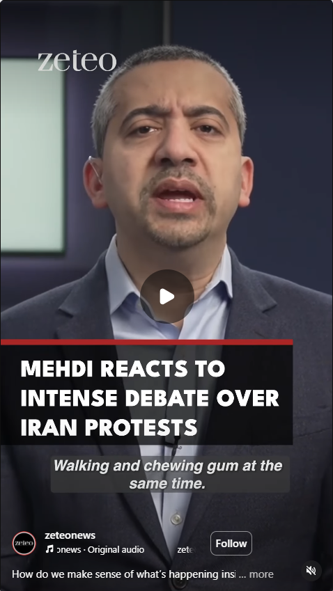

## On Jan 17, 2026, Mehdi Hassan posted:

"Walking and chewing gum at the same time. You've heard that phrase, right? The ability to multitask, to be able to do or think two or more things at the same time. It's not something we do enough of in the media. In fact, in our current social media age of outrage and clickbait and hot takes of trying to ride the algorithmic wave, you've either got to walk or chew gum, but not together, not at the same time. Oh no. There's no room for nuance, caveat, disagreement of holding two thoughts about one topic at the same time. But here's the thing, on Iran, one of the biggest stories in the world right now, I'd like us to be able to walk and chew gum at the same time, because right now, you have a lot of people in the Iranian diaspora especially, saying the world should be condemning the killing of Iranian protesters by a brutal Iranian government. And you have a lot of people, including on the left, saying the world should be opposing Israeli interference and US attempts at regime change in Iran. And I'm saying we can do both. To my friends on the left, I say this, to deny that atrocities are taking place against Iranian protesters, many of them unarmed, not violent, to deny that they are being gunned down in their hundreds, if not thousands, is ridiculous. You can't just ignore the eyewitness reports of mass killings, disablements and torture. You can't ignore the verified videos coming out of Iran of corpses lined up at hospitals and morgues. You can't just ignore evidence gathered by Amnesty International of Iranian security forces having, quote, repeatedly fired rifles and shotguns loaded with metal pellets, targeting unarmed protesters frequently in their heads and torsos. And if you do want to just dismiss groups like Amnesty and say they're biased, then what's the difference between you and the Israeli government? Sorry, you can't just pick and choose which human rights reports you want to believe. And to my friends in the Iranian diaspora, you also can't expect the rest of us to ignore the clear Israeli attempts to incite violence and regime change inside of Iran, which the Israelis aren't even hiding. The Israeli Mossad, their fassí account, openly said to Iran's protesters on December 29th, "We are with you." Not only from a distance and verbally, we are with you in the field. And a prominent Israeli reporter at a pro-Netanyahu news channel said just the other day, "Foreign actors are arming the protesters in Iran with live firearms, which is the reason for hundreds of regime personnel killed. Everyone is free to guess who is behind it." Yeah. Guess. Maybe it's the one country in the Middle East that has a clear interest in all its neighbors and the region being riven by civil war. Nor can you expect us in this moment to ignore the US's own sordid history of CIA regime change in Iran, going back to 1953 and the coup against elected Iranian Prime Minister Mohammad Mosaddegh, or the role of hawkish US senators right now in boosting the unelected son of the unelected and brutal Shah of Iran, or expect us to pretend that the Trump administration gives a damn about Iranians. The same Trump administration that has repeatedly deported Iranian asylum seekers back to Iran in shackles, including just last month. So, I don't care what this or that online mob says. On Iran, I'm not going to apologize for walking and chewing gum at the same time, for being morally consistent and saying that Iranians, like everyone in the Middle East, of course, deserve freedom and dignity and democracy, and that of course, the killing of civilians is always wrong, whether in Gaza or in Iran, and for being politically consistent too, and saying that the US and Israeli governments should stay out of Iran's affairs, and that they have no credibility when it comes to protecting innocent lives in the Middle East, when they are right now still doing a genocide together in Gaza." [1] ([Instagram][1])

## My thoughts on the Iranian Protests

* **Iranian regime must go**

  * A government that survives by shooting, jailing, torturing, and disappearing its own people has forfeited any claim to legitimacy.
  * If “order” requires mass repression, that’s not order—it’s occupation.

* **Iranian protesters have my full support and my wishes for self-determination**

  * Their future should be decided by Iranians—inside Iran—not by diaspora power brokers, not by Western capitals, not by regional intelligence services.
  * I’m not interested in ideological purity tests when people are bleeding in the streets.

* **Violence only serves the regime’s narrative and scares supporters away**

  * Violence is the regime’s favorite gift: it lets them rebrand a popular uprising as “terrorism,” justify a crackdown, and peel away the cautious middle.
  * The more the story becomes “armed insurgency,” the easier it becomes for fence-sitters, neutral institutions, and potential defectors to stay on the sidelines.

* **Nonviolent movements tend to achieve more of their goals** [2]

  * Not because dictators have a conscience, but because nonviolence scales participation and makes defections possible—socially, politically, and psychologically. ([Harvard Kennedy School][2])

* **The US and Israel are the worst possible actors to involve themselves**

  * Their involvement doesn’t “help”; it contaminates. It hands Tehran a prepackaged justification and turns Iranian self-determination into someone else’s proxy war.
  * They have strategic interests, not humanitarian ones—and everyone in the region knows it.

* **On Shahzadeh Reza Pahlavi**

  * In my opinion, he reads like an opportunist—someone positioned to benefit from chaos, and someone whose incentives may align very comfortably with Washington, Tel Aviv, or both. I cannot prove anyone is “in someone’s pocket,” but I do know how these pipelines of influence work.
  * **If the people of Iran want him, they can have him.** That is literally the point of self-determination.
  * **If the people of Iran want to use him as a symbol to counter the regime, then so be it.** Symbols are tools. The only non-negotiable is that the tool doesn’t become the owner.

---

### Footnotes

1. Transcript source: Instagram Reel (Zeteo on Instagram). ([Instagram][1])
2. Erica Chenoweth, TEDxBoulder talk on nonviolent civil resistance (YouTube: “YJSehRlU34w”). ([Harvard Kennedy School][2])

[1]: https://www.instagram.com/reel/DToOJvKEtLg/ "Zeteo on Instagram: \"How do we make sense of what's ..."
[2]: https://www.hks.harvard.edu/sites/default/files/2024-05/Erica%20Chenoweth_2020-005.pdf "CARR CENTER FOR HUMAN RIGHTS POLICY HARVARD ..."
